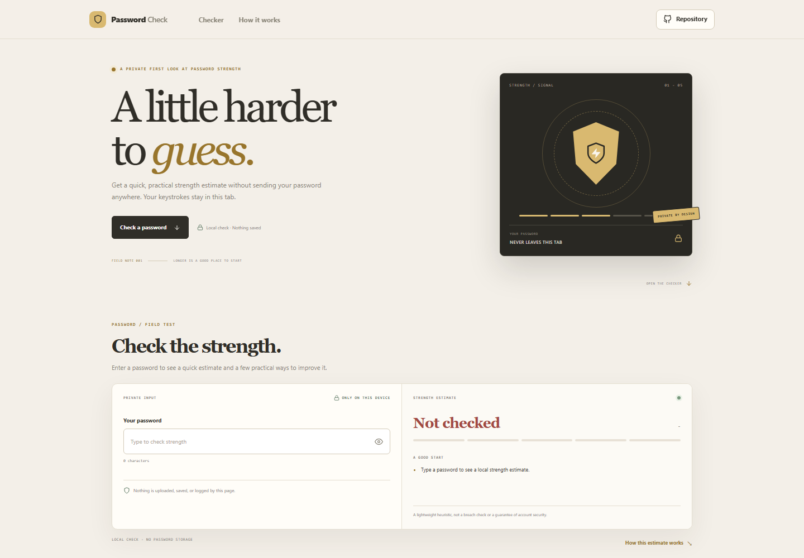



# Password Strength Checker

Get a quick local estimate of password strength and suggestions for improving it. The checker evaluates the text in the current browser tab and does not send it to an account or server.

**Live app:** [https://a2rp.github.io/password-strength-checker/](https://a2rp.github.io/password-strength-checker/)

## Features

- Estimates strength using length, character variety, repeated characters, common fragments, and simple sequences.
- Gives specific improvement suggestions and a five-level visual meter.
- Lets you reveal or hide the current input and clear it from the page.
- Keeps the password in transient page state only; no project storage or password endpoint is used.
- Responsive layout, keyboard-accessible controls, and reduced-motion support.

## Use the checker

1. Enter a password in the private input field.
2. Review the strength estimate and suggestions.
3. Use the eye control to reveal or hide the text if needed.
4. Clear the field when you are done, especially on a shared device.

## Privacy and limits

The check runs in this browser tab. This project does not upload or persist the password. The value is removed from the page when you clear it or refresh the page.

This is a lightweight heuristic, not a cryptographic entropy calculation or a check against breached-password lists. It cannot guarantee account security. Use long, unique passwords and a trusted password manager.

## Development

Requirements: Node.js and npm.

    npm install
    npm run dev

Run checks and create a production build:

    npm test
    npm run lint
    npm run build

Publish to GitHub Pages:

    npm run deploy

## Future improvements

- Add an optional passphrase generator with local copy controls.
- Add more robust dictionary and pattern checks using a maintained local word list.
- Add a compact explanation of how each signal changes the estimate.

## Links

- Portfolio: [https://www.ashishranjan.net](https://www.ashishranjan.net)
- GitHub: [https://github.com/a2rp](https://github.com/a2rp)
- CodePen: [https://codepen.io/ash1198](https://codepen.io/ash1198)
- LinkedIn: [https://www.linkedin.com/in/aashishranjan](https://www.linkedin.com/in/aashishranjan)
- Facebook: [https://www.facebook.com/theash.ashish/](https://www.facebook.com/theash.ashish/)
- YouTube: [https://www.youtube.com/@ashishranjan-ashz?sub_confirmation=1](https://www.youtube.com/@ashishranjan-ashz?sub_confirmation=1)
- Email: [mailto:ash.ranjan09@gmail.com](mailto:ash.ranjan09@gmail.com)

## Support

- Support: [https://a2rp-donation-page.netlify.app/](https://a2rp-donation-page.netlify.app/)
- Buy Me a Coffee: [https://buymeacoffee.com/ashishranjan](https://buymeacoffee.com/ashishranjan)
- Patreon: [https://www.patreon.com/ashishranjan](https://www.patreon.com/ashishranjan)
